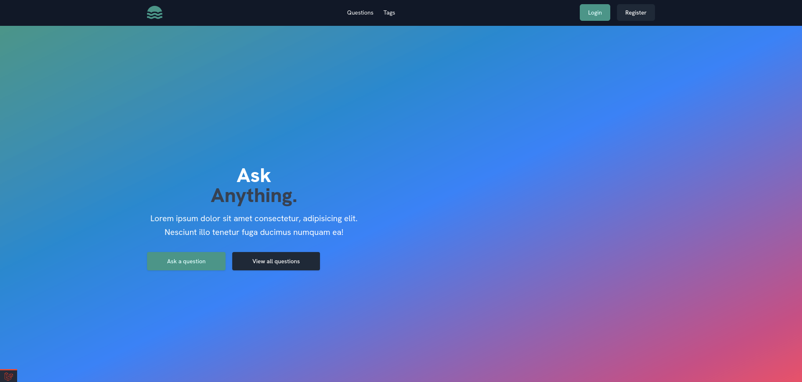

# Ask It Out

Ask It Out is a Laravel-based Q&A platform where users can ask and answer questions, similar to Stack Overflow. It features user authentication, question management, and a modern frontend powered by Vite and Tailwind CSS.

## Features

- User registration and authentication
- Ask and answer questions
- Responsive design with Tailwind CSS
- Fast asset bundling with Vite
- PostgreSQL database support

## Screenshots

Below are previews of the application from the `Screenshots` folder:

| Home Page | Ask Question | Questions List |
|-----------|--------------|---------------|
|  |  |  |

## Getting Started

### Prerequisites

- PHP >= 8.1
- Composer
- Node.js & npm
- PostgreSQL

### Installation

1. **Clone the repository:**
    ```sh
    git clone <repository-url>
    cd askitout
    ```

2. **Install PHP dependencies:**
    ```sh
    composer install
    ```

3. **Install JS dependencies:**
    ```sh
    npm install
    ```

4. **Copy and configure environment:**
    ```sh
    cp .env.example .env
    # Edit .env to match your database and app settings
    ```

5. **Generate application key:**
    ```sh
    php artisan key:generate
    ```

6. **Set up the database:**
    - Create a PostgreSQL database and user as specified in your `.env`.
    - Run migrations:
      ```sh
      php artisan migrate
      ```

7. **Run the development servers:**
    ```sh
    php artisan serve
    npm run dev
    ```

8. **Visit the app:**
    - Open [http://localhost:8000](http://localhost:8000) in your browser.

## Folder Structure

- `app/` - Laravel backend code
- `resources/views/` - Blade templates
- `public/` - Public assets
- `Screenshots/` - Application screenshots

---

**Enjoy using Ask It Out!**